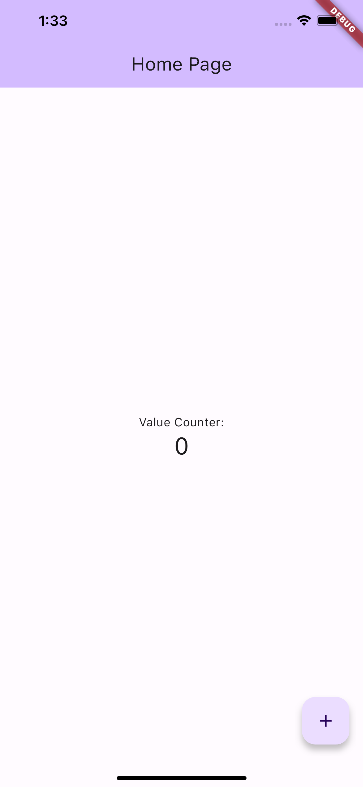

# Delegate Pattern Example in Flutter

> **Delegation** is a way to make composition as powerful for reuse as inheritance [Lie86, JZ91]. In delegation, _two_ objects are involved in handling a request: a receiving object delegates operations to its **delegate**. This is analogous to subclasses deferring requests to parent classes. But with inheritance, an inherited operation can always refer to the receiving object through the `this` member variable in Dart and `self` in Swift. To achieve the same effect with delegation, the receiver passes itself to the delegate to let the delegated operation refer to the receiver. (Gamma _et al._ 1994)

In Dart, you can use a `Mixin` because it allow us to add functionality to Dart classes and reuse their code in different class hierarchies.

## Example
In this example, I'll get the example that Flutter already give us when creating a new app from the scratch.

So, we have the home page with incrementing button, just like the image down below.



When looking in code, it is a simple `class` extending to a `StatefullWidget` with a `Column`, 2 widgets `Text`, one of them static and the other is the counter, and a Floating Button.

When clicking in the button, the `counter` it calls a `setState` to update the `counter` value.

But what if we use the `presenter` or `controller` to act as the responsable for this increment? Or, we use the increment action on another screen? 

We can use delegate!

So, in dart, it is common use `mixin` to declare, but you can also use `abstract class`, it depends on what you need. You can check the differences in [here](https://medium.com/@m.a.afrazandeh/mixins-vs-interfaces-in-dart-dffe614d295d).

To make this example, I created a new folder called `home` and added a file called `home_view.dart` and `home_presenter.dart`.

In `home_view.dart`, I pasted all the code corresponding the view.
`class HomeView extends StatefulWidget {...}` and `class _HomeViewState extends State<HomeView> {...}`.

In `home_presenter.dart`, I just create the class:
```
class HomePresenter { }
```

Now, looking to the code from `home_view.dart`, I noticed that the `increment` function could be on `HomePresenter`. So, I added to `HomePresenter`.

```
class HomePresenter {
  void increment(int value) {
    value++;
  }
}
```

But I also had to send the value back to the view, so I can add a `setState` for the widget perform the update.

Then, I created a `mixin` on `home_presenter.dart`, sending the value.

```
mixin HomeViewDelegate {
  void counter(int value);
}
```

To send, I have to have a reference in `HomePresenter`, I added the following code: 
```
class HomePresenter {
  HomePresenter(this._viewDelegate);

  final HomeViewDelegate? _viewDelegate;

  void increment(int value) {
    value++;
    _viewDelegate?.counter(value);
  }
}
```

Returning to the view page, I can remove the `increment` function.

I can also implement the `HomeViewDelegate` by adding `implements HomeViewDelegate` on the declaration of the class.
```
class _HomeViewState extends State<HomeView> implements HomeViewDelegate { ... }
```

It will show an error asking for you to implement the missing method. If you tap on `Create 1 missing method`, it will show a function like this:
```
@override
void counter(int value) {
    // TODO: implement counter
}
```

Instead of the TODO commented, you will add the `setState` method, it will look like this:
```
  @override
  void counter(int value) {
    setState(() {
      _counter = value;
    });
  }
```

But the action on the button is still showing an error. Because you are not calling the function from the `presenter`.

You just need to declare the presenter variable, it should look like this:

```
late final HomePresenter _presenter = HomePresenter(this);
```

It has to have the particle `late`, otherise it will show an error.

## Run this project

After clone this repository in your computer, by using `git clone <url>`, you should enter the folder using `cd delegate_example_app`.

Then, you should run `pub get` to download the dependences.
```
flutter pub get
```

And then add the platforms so you can test the project by running:
```
flutter create .
```

And is now ready to test!
```
flutter run
```

## References
- https://en.wikipedia.org/wiki/Delegation_pattern
- https://archive.org/details/designpatternsel00gamm/page/20/mode/2up
- https://dart.dev/language/mixins
- https://betterprogramming.pub/how-to-implement-the-delegation-design-pattern-in-dart-d782de77c886
